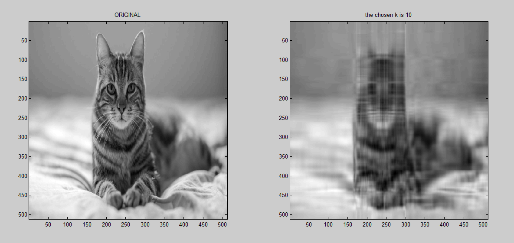

# svd-image-compression

In this project, we are going to implement image compression using singular value decomposition method.

We are going to use matlab for this project!

# What is singular value decomposition (SVD)?

In linear algebra, the singular value decomposition (SVD) is a factorization of a real or complex matrix that generalizes the eigendecomposition of a  square normal matrix to any  matrix  via an extension of the polar decomposition.

Specifically, the singular value decomposition of an  complex matrix M  is a factorization of the form  , where U is an  complex unitary matrix,   is an  rectangular diagonal matrix with non-negative real numbers on the diagonal,  and V is an   complex unitary matrix. If M is real, U and  are real orthogonal matrices.

The diagonal entries  of  are known as the singular values of M. The number of non-zero singular values is equal to the rank of M. The columns of U and the columns of V are called the left-singular vectors and right-singular vectors of M, respectively.

The SVD is not unique. It is always possible to choose the decomposition so that the singular values  are in descending order. In this case,  (but not always U and V) is uniquely determined by M.

    As the Eckart-Young theorem says, we can approximate A by a low rank matrix Ak: 
    A = σ1v1u1 + σ2v2u2 + … + σnvnun, where σ's are the diagonals of ∑, v's are the entries of V 
    and u's are the entries of U
    
    so Ak = σ1v1u1 + σ2v2u2 + … + σkvkuk , k<n

# Coding part

Let's read an image from our choice :

	
	% I loaded a color image
	RGB = imread('cat.jpg');

	% covert image to grayscale image
	A =  mat2gray(RGB);  
	A = rgb2gray(A); 
	
	% resize the image : 512 by 512
	A = imresize(A,[512 512]); 

The image is a matrix 512 by 512. Every pixel is represented in the matrix by a
number from 0 to 512. We are looking for compressing that image using SVD
image compression method. Using this method, we will retrieve some
information from the image but the image quality have to remain good.

Now let's perform svd on the matrix A:

	[U, S, V] = svd(A);

Now we have the three matrices needed!

Let's take the singular values be runnig the following line of code:

	[U, S, V] = svd(A);

Now let's approximate our matrix A by a low rank matrix Ak using diffrent values for k:

	%k = 1, 10, 100 later on we will try all those values
	k = 1; 
	Ak = U(:,1:k)*S(1:k,1:k)*V(:,1:k)';

	%plot the original image next to compressed one 
	subplot(1,2,1); 
	imagesc(A); colormap gray; axis image; title('ORIGINAL'); 
	subplot(1,2,2);
	imagesc(Ak); colormap gray; axis image; title('1-image');

After executing the code, here is our result for k=1 :

Now let's set k=10:

